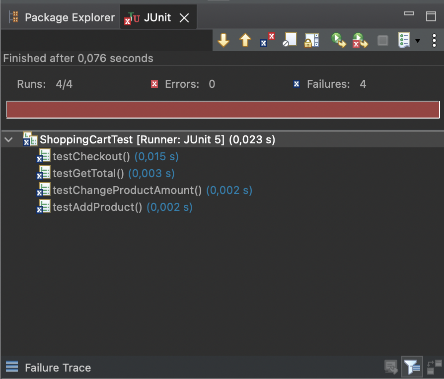
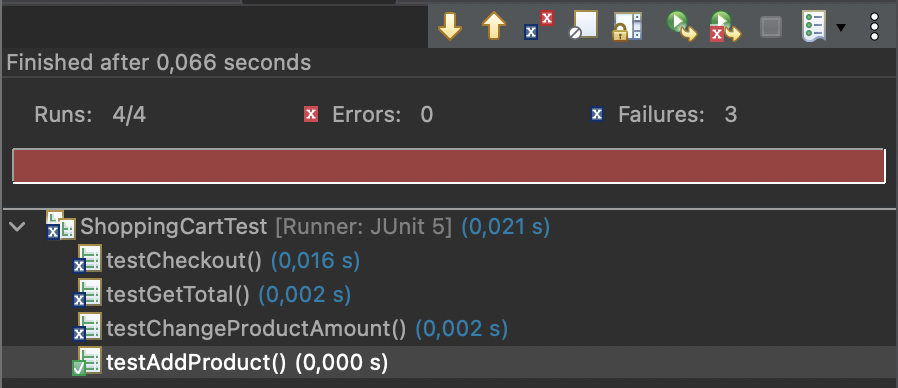
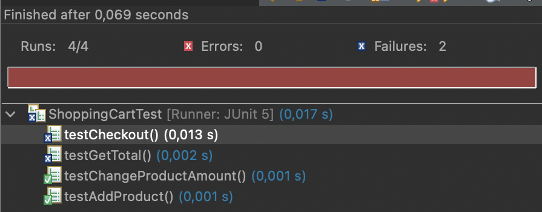
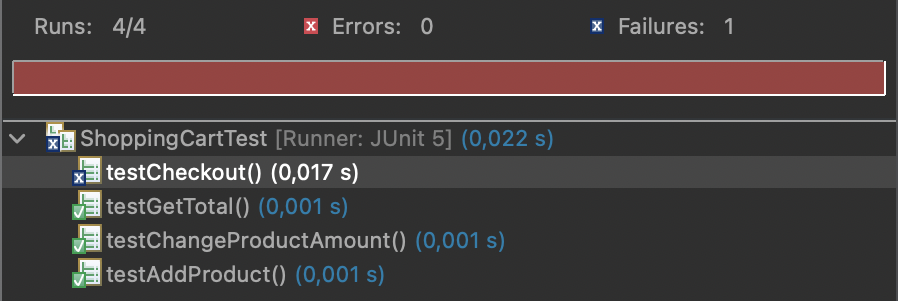
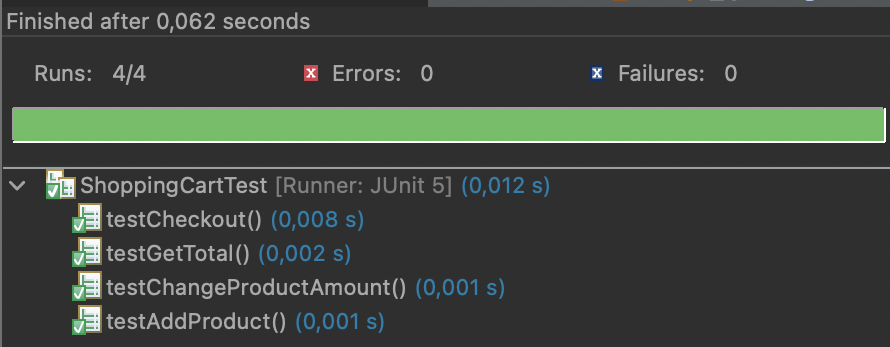

# Erste Idee
Als erstes habe ich mir aufgemalt, wie ich mir das Programm vorstelle:

## Grundstruktur
In meinem ersten Commit nach der Erstellung der README.md sehen Sie meine erste Struktur, die bereits eine vollständige UI implementiert.
Die Klassen `Product`, `ShoppingCart` und `ShoppingCartEntry` bilden die logische Struktur.
Es fehlt jetzt lediglich die Implementation der Klasse `ShoppingCartEntry`. Ihre Methoden habe ich mir aber bereits überlegt und diese auch schon in der UI implementiert.
Als nächstes werde ich mir die Tests für die Klasse überlegen und dann wie gewünscht die Features Schritt für Schritt implementieren.

## Tests
Die Tests habe ich mir überlegt, sie sind womöglich nicht vollständig. Während des Schreibens sind mir immer wieder neue Dinge eingefallen.
Aber die Grundanforderungen werden definitiv klar und ich werde jetzt im nächsten Schritt alle Funktionieren so implementieren, dass alle Tests bestanden werden.
Danach werde ich das Programm mittels der UI testen und sehen, wie vollständig meine Tests denn dann wirklich waren!

### AddProduct
Hier war die Implementierung eigentlich straight-forward. Aber dann fiel mir auf, dass ein normales Array für `entries` nicht tauglich war, da ich ja dynamisch Elemente hinzufügen wollte. Also habe ich umgerüstet auf eine `ArrayList` und somit musste ich auch die Tests anpassen, die direkt auf die Variable zugreifen.

Der Test `testAddProduct` glückt nun bereits. Ein Refactoring ist meiner Meinung nach überflüssig.

### ChangeProductAmount
Die Funktion erfüllt gleich drei Zwecke. Sie muss erstens die Anzahl von Produkten bei bestehenden Einträge im Warenkorb anpassen. Desweiteren muss sie auch neue Einträge hinzufügen, wenn das Produkt noch nicht im Warenkorb ist. Zu guter Letzt muss das Produkt bei einer gewünschten Anzahl von 0 dann wieder aus dem Warenkorb entfernt werden.
Nachdem ich die Funktion so implementiert hatte, dass sie die Tests besteht, habe ich noch schnell ein Refactoring hinterhergeschoben, bei dem ich duplizierten Code aus der Methode entfernt habe.

### GetTotal
Diese Funktion war wirklich sehr simpel und ich schreibe nicht mehr dazu.

### Checkout
Okay, diese Funktion war noch simpler, als `GetTotal`. Aber man muss natürlich dazu sagen, dass es sich hier um keine wirkliche Checkout-Funktion sondern eher um einen Platzhalter im Rahmen des begrenzten Projektrahmens handelt. Denn die Checkout-Funktion soll nur beispielhaft den Warenkorb leeren. Ein Kauf-Prozess wäre in der Realität natürlich Teil des Checkouts und wahrscheinlich der komplexeste Prozess des gesamten Projekts.

Aber tatsächlich sehen wir jetzt endlich den grünen Balken, mal schauen, wie der Realitätstest mit der GUI jetzt abläuft.

## Anpassungen GUI & Ergebnis
Tatsächlich fiel beim Testen der GUI dann noch auf, dass ich einen Logikfehler beim Visualisieren des Warenkorbs eingebaut hatte. Den habe ich behoben und zusätzlich noch einen "Bezahlen"-Button sowie die Anzeige des Warenkorbpreises hinzugefügt.
Nach meinem Test bin ich der Auffassung, dass das Programm fehlerfrei funktioniert.

